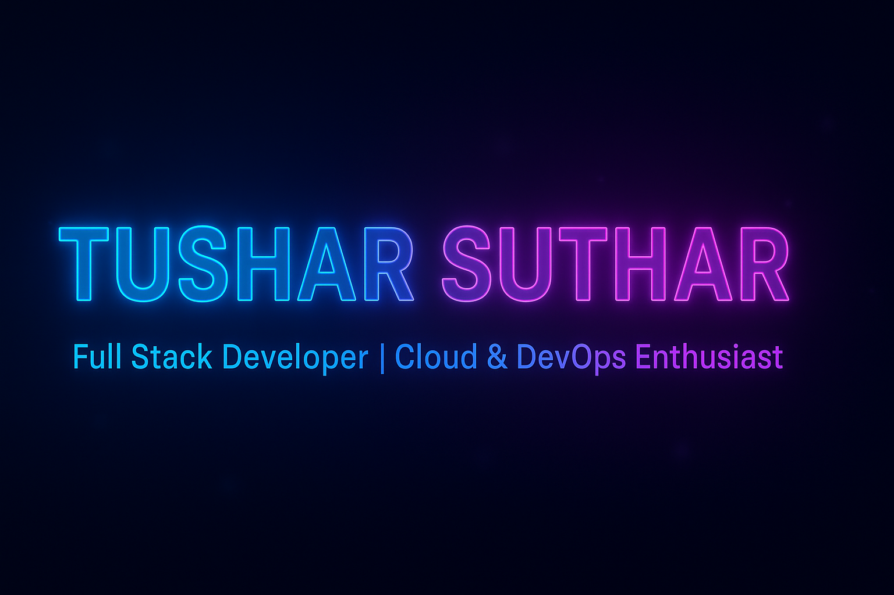

<!-- 🟣 TUSHAR SUTHAR | DARK GLASS PORTFOLIO README -->

  

<h1 align="center">Hi 👋, I'm Tushar Suthar</h1>
<h3 align="center">A passionate Full Stack Developer & MCA Student from India 🚀</h3>

  <em>Software Developer | Cloud & DevOps Learner | Problem Solver</em>

  
  
  &nbsp;&nbsp;
  

---

## 👨‍💻 About Me

- 🎓 **MCA Student** at *Thakur Institute of Management Studies, Career Development & Research (TIMSCDR)* — *University of Mumbai*  
  📆 *2024–2026* | SGPI: 7.85  

- 🎓 **B.Sc. in Information Technology** — *GLS University, Ahmedabad (2023)*  
  📊 CGPA: 6.98 / 10  

- 🌱 Currently learning **Advanced Java**, **MERN Stack**, **Cloud Computing**, and **DevOps**  
- 💼 Working on real-world projects like **Kisan Kart**, **QuickCoWork**, and **Python Automation Suite**  
- 💬 Ask me about **Java, Python, JavaScript, React, Spring Boot, Node.js, and DSA**  
- 📫 Reach me at **[tusharsuthaar@gmail.com](mailto:tusharsuthaar@gmail.com)**  
- ⚡ *Fun Fact:* I love solving DSA problems and designing meaningful digital products.

---

## 🧠 Career Objective

> Passionate about developing scalable, maintainable, and secure software solutions that bridge innovation and user needs.  
> I thrive in collaborative environments where technology drives real-world impact through automation and clean code.

---

## 🚀 Featured Projects

### 🤖 Python Communication Automation Suite — Multi-Channel Automation Tool
- Automated communication across **Email, SMS, WhatsApp, and Voice Calls** using Flask and Twilio.  
- Integrated **LinkedIn, Twitter, Facebook, and Instagram APIs** for social media automation.  
- Modular, scalable, and API-secure design for multi-task communication.  
🛠️ *Tech:* Python, Flask, Twilio, REST APIs

---

### 📝 Transcript Summarizer — Web-Based Text Summarization Tool
- Used **NLP and Hugging Face Transformers** to summarize long transcripts into concise text.  
- Built an intuitive **Flask web app** with modern frontend for interactive text processing.  
🧠 *Tech:* Python, NLP, Hugging Face, HTML, CSS

---

### 🌾 Kisan Kart — E-Commerce Platform for Agricultural Products
- Full-stack e-commerce app for farmers and agri businesses.  
- Features: Product listing, shopping cart, user authentication, admin dashboard.  
- REST API-based architecture with responsive UI.  
🧩 *Tech:* React.js, Java Spring Boot, MySQL  
🔗 [Frontend Repo](https://github.com/TusharSuthaar/Kisan_Kart_UI) | [Backend Repo](https://github.com/TusharSuthaar/Kissan_Kart_backend)

---

  
<b>🧩 More Projects</b>

  
  - **QuickCoWork** — Workspace management platform *(React, Node.js, MongoDB)*  
    🔗 [Frontend Repo](https://github.com/TusharSuthaar/quickcowork-frontend)
  - **PrepInsta Top 100 Codes** — DSA practice problems in Python  
    🔗 [Repo](https://github.com/TusharSuthaar/prep-insta-top-100-Codes)
  - **Kisan Kart Vision** — AI Vision module for Agri-commerce  
    🔗 [Repo](https://github.com/TusharSuthaar/kisan-kart-vision)

---

## 💼 Professional Experience

**☁️ Summer Intern — AWS Cloud & DevOps**  
*LinuxWorld Informatics Pvt. Ltd., Jaipur* | Jun 2025 – Jul 2025 (45 Days)  
- Mentored by CTO **Mr. Vimal Daga**  
- Worked with **AWS, Docker, Jenkins, Git, Kubernetes**  
- Built **CI/CD pipelines**, deployed scalable containers, and practiced **IaC (Infrastructure as Code)**  

---

## 🧠 Technical Skills

| Category | Tools / Technologies |
|-----------|---------------------|
| **Languages** | Python, Java, JavaScript |
| **Frontend** | React.js, HTML5, CSS3, Bootstrap |
| **Backend** | Flask, Node.js, Spring Boot |
| **Databases** | MySQL, PostgreSQL |
| **Cloud & DevOps** | AWS, Docker, Jenkins, Kubernetes |
| **Version Control** | Git, GitHub |
| **Tools** | Linux, Shell Scripting, Postman, VS Code, Jupyter, Eclipse |

---

## 🧩 Languages & Tools

  
  
  
  
  
  
  
  
  
  
  
  
  
  

---

## 🏆 Certifications & Achievements

- ⭐ 5★ in Python — HackerRank  
- 📜 Responsive Web Design — freeCodeCamp.org  
- 📜 JavaScript Algorithms & Data Structures — freeCodeCamp.org  
- 🌐 Introduction to Front-End Development — Meta (Coursera)

---

## 🎯 Hobbies & Interests

- ♟️ Playing Chess  
- 🎧 Listening to Music  
- 🎮 Gaming  

---

## 🌐 Connect with Me

  
  
  
  
  

---

## 📊 GitHub Stats

  
  

  

  

---

  <em>💡 “Code is like humor — when you have to explain it, it's bad.” – Cory House</em>

  

